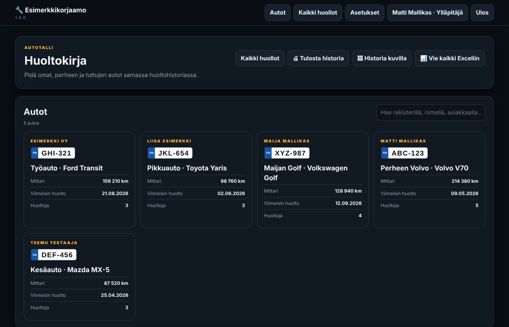
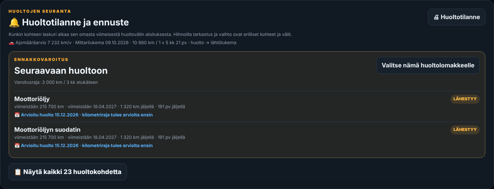
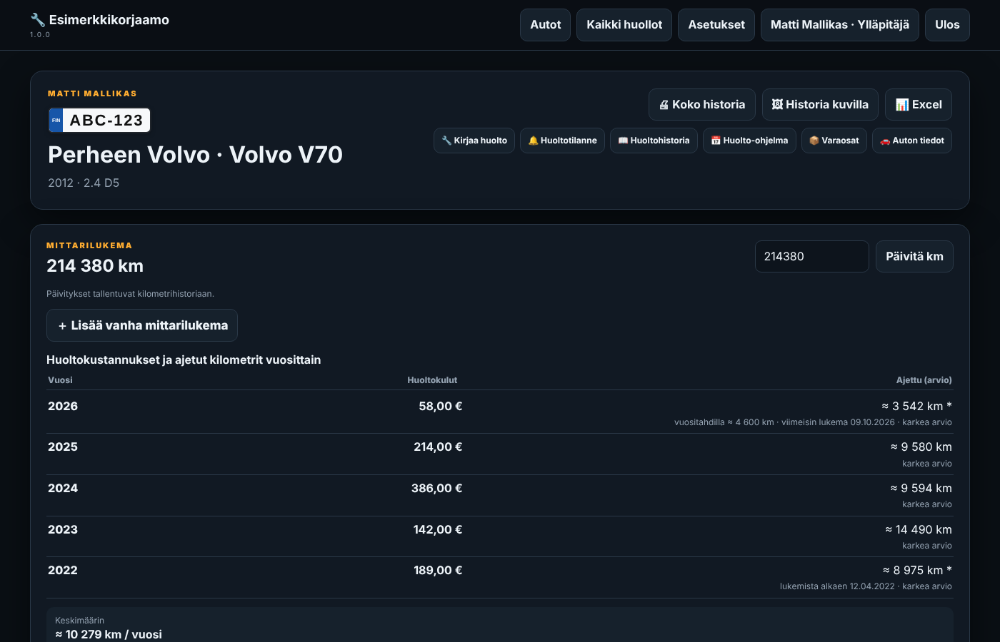
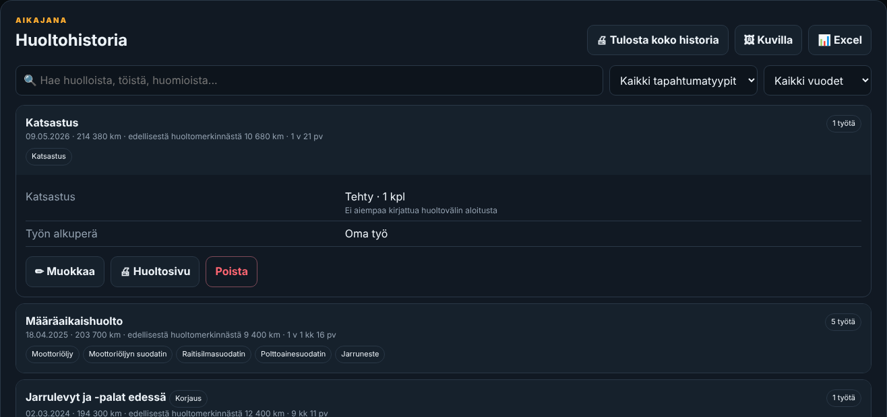
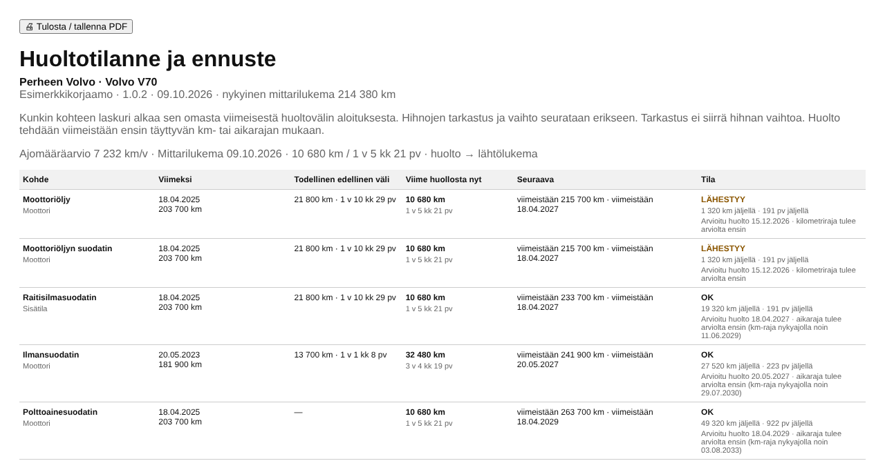
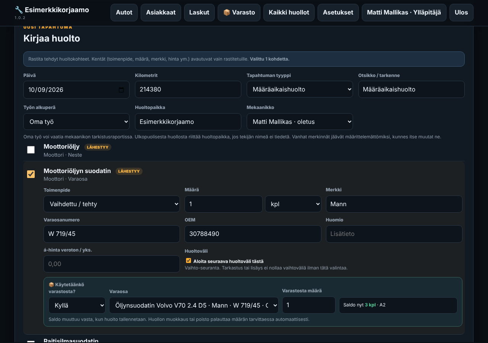
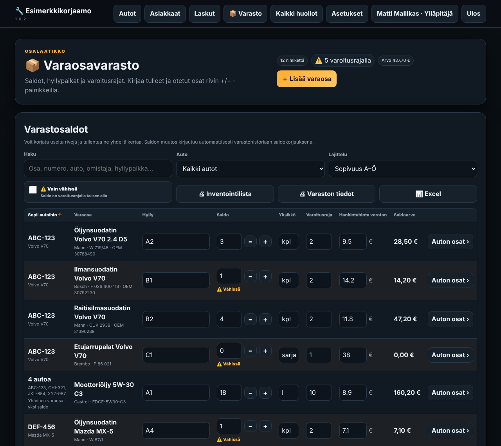
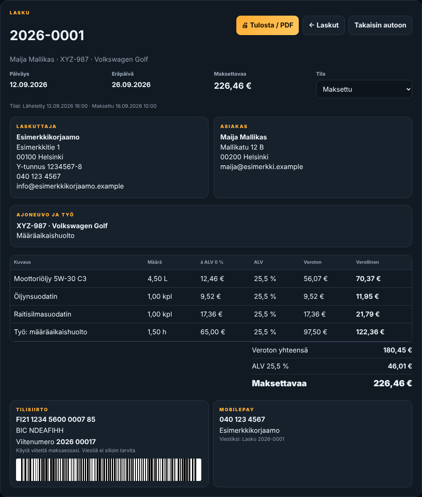
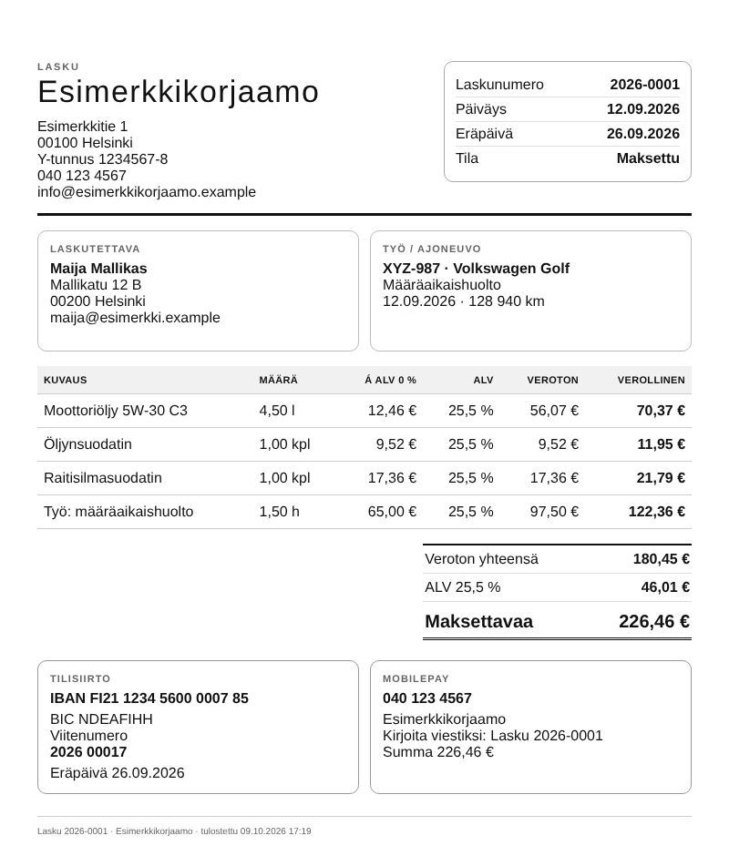
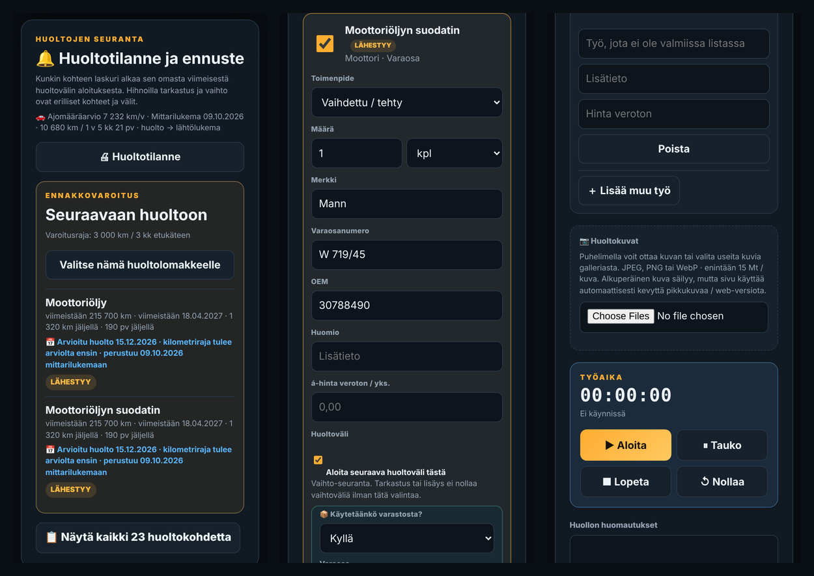

# Autonhuolto

Koodivarasto: <https://github.com/oh6kw/autonhuolto>

Kevyt, itse ajettava **huoltokirja- ja pienkorjaamo-ohjelma** autoille. Sopii harrastajalle, perheen autoille ja pienelle korjaamolle, joka haluaa pitää huoltohistorian, varaosat, asiakkaat ja laskut yhdessä paikassa ilman raskasta järjestelmää.

*English summary: Autonhuolto is a lightweight, self-hosted car maintenance log and small-workshop tool (PHP 8.2+, SQLite, no external dependencies). Works in any browser on phone, tablet and desktop, so a mechanic can log a service and take photos on the spot. The user interface is in Finnish. Licensed under AGPL v3.*

## Toimii puhelimella ja tietokoneella

Käyttöliittymä mukautuu automaattisesti näytön kokoon, joten samaa ohjelmaa voi käyttää kännykällä, tabletilla ja tietokoneella ilman erillistä sovellusta (riittää selain). Mekaanikko voi kirjata huollon heti työn ohessa puhelimella: rastittaa tehdyt työt, ottaa kuvat suoraan puhelimen kameralla tai valita ne galleriasta, käynnistää työajastimen ja tarkistaa varaston saldon. Toimisto- ja laskutustyöt (laskut, tulosteet, Excel-viennit, asetukset) sujuvat luontevimmin tietokoneella.

- Autot, mittarilukemahistoria ja ajomääräarvio
- Kohdekohtaiset huoltovälit, huoltotilanne ja erääntymisennusteet
- Huoltohistoria kuvineen (kuvat suoraan puhelimen kameralla), mekaanikot ja työajastin
- Mobiilikäyttöinen: kirjaus onnistuu työn ohessa puhelimella
- Varaosamuistio, moniautosopivuus ja varasto saldoineen sekä varastotapahtumat
- Asiakkaat ja auton omistushistoria
- Laskut (myös MobilePay-tiedot), tulosteet / PDF ja Excel-viennit
- Käyttäjät ja roolit (ylläpitäjä, tallentaja, katselija), tapahtumaloki
- Verottomat tai verolliset hinnat valittavissa, ALV-muunnos varastossa
- Tietojen tarkistus, SQLite- ja täysi ZIP-varmuuskopio sekä palautus selaimesta
- Ei ulkoisia kirjastoja: yksi PHP-sovellus ja yksi SQLite-tiedosto

## Kuvakaappauksia

Kuvissa on keksittyä esimerkkitietoa (kuvitteellinen korjaamo, autot ja asiakkaat).

### Mobiilinäkymä

## Vaatimukset

PHP 8.2 tai uudempi, laajennukset `pdo_sqlite` ja `mbstring` (suositeltu myös `zip` ja `gd`) sekä Apache tai Nginx. HTTPS on vahvasti suositeltu.

## Pika-aloitus

1. Kopioi tiedostot palvelimen kansioon (esim. `/var/www/html/autonhuolto/`), ja anna web-palvelimen käyttäjälle kirjoitusoikeus kansioon.
2. Estä tietokannan suora lataus (`SETUP.md`, kohta 3.4). Tämä on tärkeä.
3. Avaa kansio selaimella ja luo ensimmäinen ylläpitäjätunnus.

Täydellinen asennus-, käyttö- ja varmuuskopio-ohje vasta-alkajalle: **[SETUP.md](SETUP.md)**. Varmuuskopioinnin tekninen tiivistelmä: [BACKUP.md](BACKUP.md). Muutokset: [CHANGELOG.md](CHANGELOG.md).

## Turvallisuus

Ohjelma sisältää kirjautumisen, ja tietokanta sisältää salasanatiivisteet ja asiakastietoja. Lue `SETUP.md` kohta 3.4 ennen kuin avaat ohjelman internetiin. Tietoturvaongelmat: katso [SECURITY.md](SECURITY.md).

## Lisenssi

[GNU Affero General Public License v3.0](LICENSE). Saat käyttää, tutkia, muokata ja jakaa ohjelmaa. Jos ajat muokattua versiota palveluna muille käyttäjille, sinun on tarjottava heille muokatun version lähdekoodi samalla lisenssillä. Aseta tarvittaessa lähdekoodin osoite tiedostoon `index.php` (`APP_SOURCE_URL`), jolloin ohjelman alatunnisteessa näkyy linkki lähdekoodiin.

## Tuki ja asennuspalvelu

Ohjelma on ilmainen. Jos haluat, että joku asentaa sen puolestasi ja opastaa alkuun, tai haluat ohjelman palveluna, ota yhteyttä: **Jarno Jaskari**, [jarno.jaskari@gmail.com](mailto:jarno.jaskari@gmail.com).

Jos ohjelmasta on hyötyä, voit tarjota kahvit: [ko-fi.com/oh6kw](https://ko-fi.com/oh6kw).
